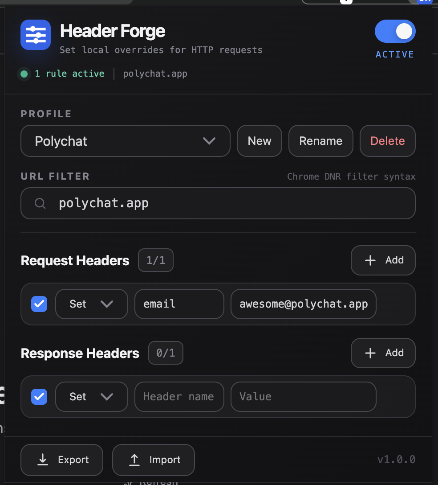

# Header Forge

Need to change HTTP headers while testing a website or API? Header Forge lets you set or remove request and response headers locally in Chrome.

## Features

- Set or remove request and response headers.
- Restrict rules with Chrome URL filters.
- Keep separate profiles for different sites or tasks.
- Pause individual rules or all changes at once.
- Back up and restore settings as JSON.
- Store all settings locally in Chrome.

## Use Header Forge

1. Install Header Forge from the Chrome Web Store and open the extension popup.
2. Choose an existing profile or select **New**.
3. Enter a URL filter:

   - `*` — all HTTP and HTTPS requests
   - `||example.com/` — `example.com` and its subdomains
   - `|https://example.com/` — URLs beginning with this exact prefix

4. Add a request or response header.
5. Choose **Set** or **Remove**, then enter the header name and value.
6. Reload the target page.

Changes save automatically. Only the selected profile is active, and the badge shows `ON` when it contains an enabled rule.

## Import and export

- Select **Export** to download all profiles and settings as `header-forge.json`.
- Select **Import** to replace the current settings with a valid Header Forge JSON file.

Export your settings before importing if you may need to restore them.

## Permissions and privacy

- Header Forge requests access to all URLs so your rules can work on any site.
- Chrome applies rules through Manifest V3's Declarative Net Request API without exposing request contents to the extension.
- Profiles and settings remain in `chrome.storage.local`.
- The extension has no accounts, analytics, telemetry, remote scripts or external API calls.

## Limitations

- Chrome protects or specially handles some headers, so not every change is permitted.
- Service workers, `CacheStorage` and cached responses can hide changes. Disable the cache in Chrome DevTools when testing if necessary.
- Header Forge supports **Set** and **Remove**, but not **Append**.
- Chrome 120 or later is required.

## Development

Header Forge has no dependencies or build step. To test a local checkout:

1. Open `chrome://extensions`.
2. Enable **Developer mode**.
3. Select **Load unpacked** and choose this repository.
4. Select the reload icon after making changes.

## Licence

MIT. See `LICENSE`.
